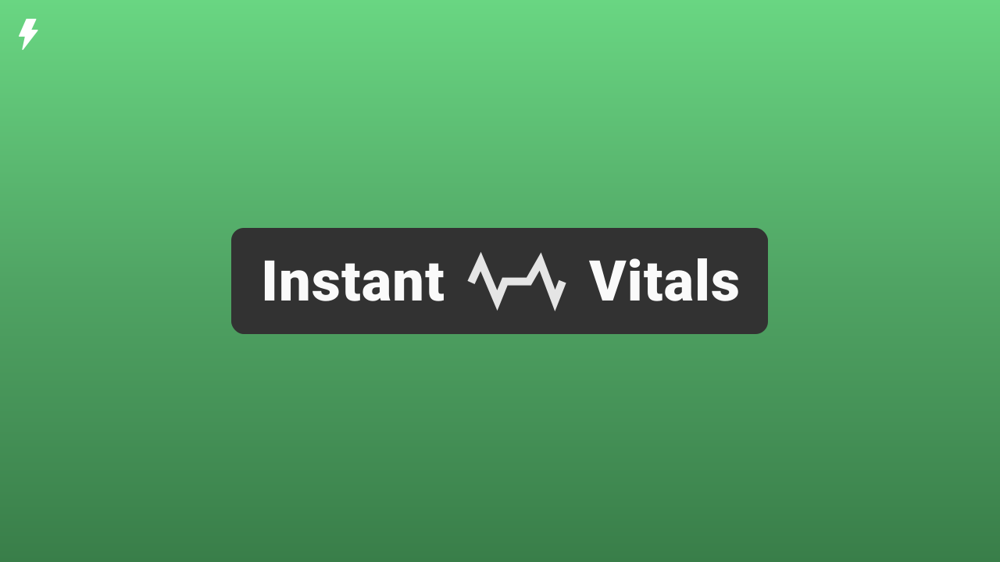

[](https://vitals.dev)

# Instant Vitals: Simple tools to track and improve your Web Vitals scores

[](https://www.npmjs.com/package/@instantdomain/vitals-client)
[](https://www.npmjs.com/package/@instantdomain/vitals-server)
[](https://github.com/InstantDomainSearch/instant-vitals/blob/main/LICENSE)

Instant Vitals is a tool for collecting Web Vitals metrics and storing them in Google BigQuery. The library has both a client and a server component. The client is responsible for collecting the metrics using web-vitals, which is developed and provided by the Google Chrome team, and sending the metrics to the endpoint of your choice. In addition to this, the client converts HTML elements into XPath query strings so that you can easily track down where your problems are later. The server component is used to then take these metrics and send them to BigQuery. Once the metrics are in BigQuery, you can more easily query for the information you need to improve your Web Vitals scores.

For now we'll assume you're using `npm` and that you have some sort of build system in place for the client. While the server component is only available for NodeJS at the moment, this library is more of a pattern than a prescription so it shouldn't be too hard to implement this yourself in your language of choice.

## Prerequisites

Instant Vitals relies on Google BigQuery to store and process data. You should create an account before getting started. Be aware that the paid tier is required to use this library; however, even with a large number of users, the cost should still be very low.

Once you have created an account, you will need to create a service account. The service account will need permission to create datasets and tables as well as insert records into the database.

## Client Installation

To get started, install the client library in your project:

```sh
npm i @instantdomain/vitals-client
```

Then, you can initialize the library like so:

```typescript
import { init } from "@instantdomain/vitals-client";

init({ endpoint: "/api/web-vitals" });
```

Here I'm using `"/api/web-vitals"` as the endpoint. you'll want to change this to an endpoint of your choice on a server that you control.

## Server Installation

First, install the server library in your NodeJS project:

```sh
npm i @instantdomain/vitals-server
```

Then, you can initialize the server component. Here is an example request handler for the endpoint `"/api/web-vitals""`

```typescript
import fs from "fs";

import { init, streamVitals } from "@instantdomain/vitals-server";

// Google libraries require service key as path to file
const GOOGLE_SERVICE_KEY = process.env.GOOGLE_SERVICE_KEY;
process.env.GOOGLE_APPLICATION_CREDENTIALS = "/tmp/goog_creds";
fs.writeFileSync(
  process.env.GOOGLE_APPLICATION_CREDENTIALS,
  GOOGLE_SERVICE_KEY
);

const DATASET_ID = "web_vitals";
init({ datasetId: DATASET_ID }).then().catch(console.error);

// Request handler
export default async (req, res) => {
  const body = JSON.parse(req.body);
  await streamVitals(body, body.name);
  res.status(200).end();
};
```

Note that here we are storing our Google Cloud service key as a string in `GOOGLE_SERVICE_KEY`. We then need to write the key to a temporary file before instructing the BigQuery library to read from that file.
